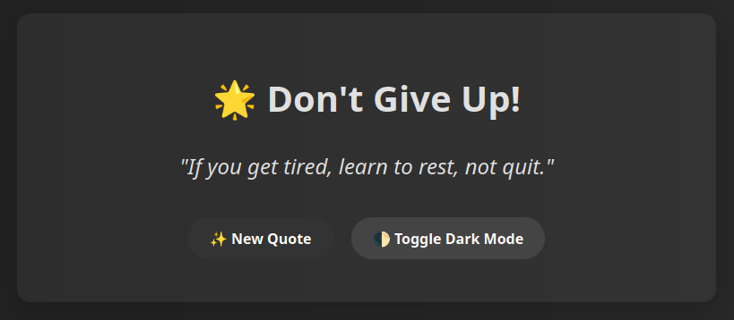
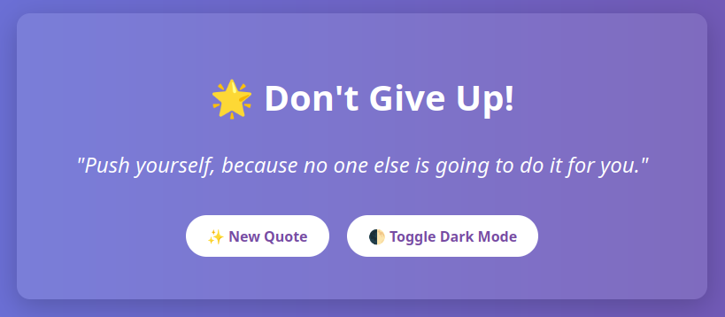

# Learning CICD

This is a repository to document my CICD learning journey.

## Overview

The Dont Give Up quotes is a beautiful Flask web application that displays random inspirational quotes to a learner motivated! Built with Python, Docker, and love 💜 — this project showcases containerization, frontend/backend integration, and a modern web design with dark mode support. 

This is a work in progress to give motivation and get going on my DevOps journey. More features would be added as journey continues. You can fork the repository and make something out of it. Contributions to this project are welcomed.
---

## Preview




---

## Features

- Flask backend serving random friendly quotes from a python list
- Responsive frontend with modern styling & dark mode
- Click to fetch new quotes via JavaScript (no page reload)
- Dockerized for portability and reproducibility
- Deployed via Docker Compose and extended with GitHub Actions CI/CD)

---

## 🛠️ Tech Stack

- **Frontend:** HTML5, CSS3, JavaScript
- **Backend:** Python 3.11 + Flask
- **Containerization:** Docker, Docker Compose
- **Version Control:** Git + GitHub
- **CI/CD:** GitHub Actions, Docker Hub, AWS ECS Fargate
- **IaC:** Terraform

---

## Getting Started

### 1. Clone the repository

```bash
git clone https://github.com/yourusername/devops-inspiration.git
cd devops-inspiration
```

### 2. Build and Run with Docker Compose

```bash
docker-compose up --build -d
```
Visit the app at: http://localhost:5000

### 3. Want to deploy it to the cloud?
```
cd infra/ecs-fargate
terraform init
terraform plan
terraform apply
```
---
# Future Features 

- [ ] User Authentication & Profiles
- [ ] Dynamic Quote Generation with Backend API
- [ ] Real-time Quote Push (WebSocket)
- [ ] Quote Voting System
- [ ] Search & Filter Quotes
- [ ] Quote Categories or Tags
- [ ] Customizable Quote Display 
- [ ] Automated Quote of the Day
- [ ] API for Third-Party Integrations
- [ ] Email Notifications 
- [ ] Admin Panel for Managing Quotes
- [ ] Social Media Sharing
- [ ] Quote Analytics Dashboard
- [ ] Responsive Design Enhancements
- [ ] Unit Testing
---
